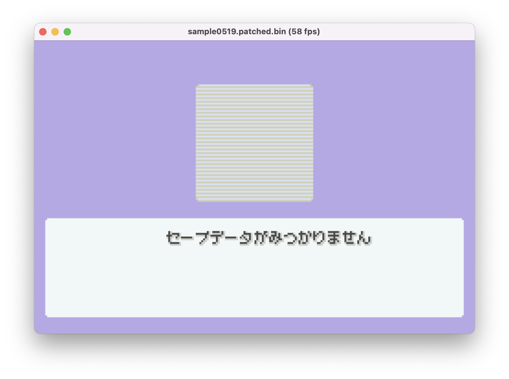
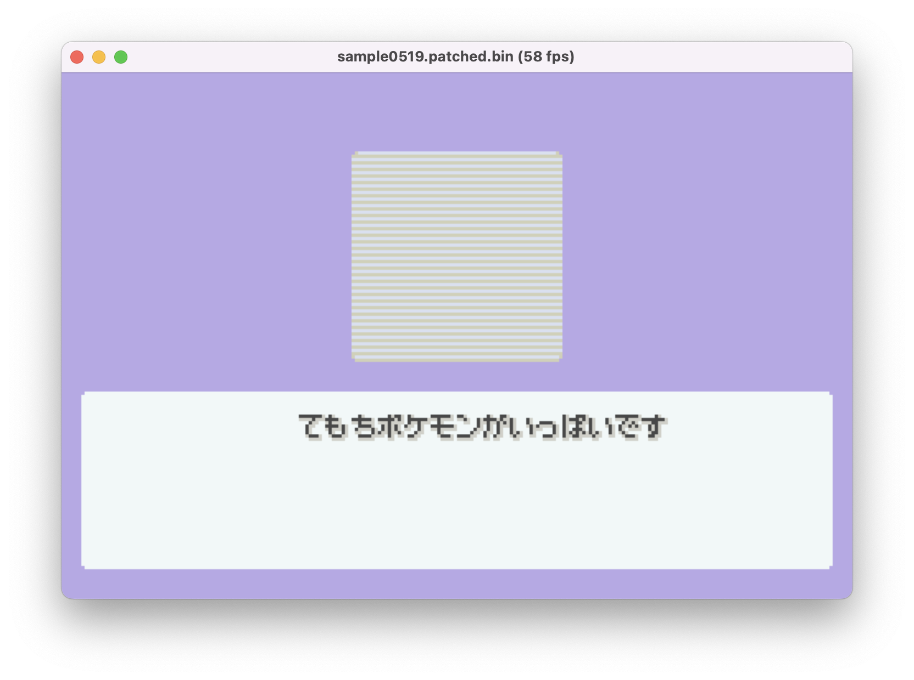
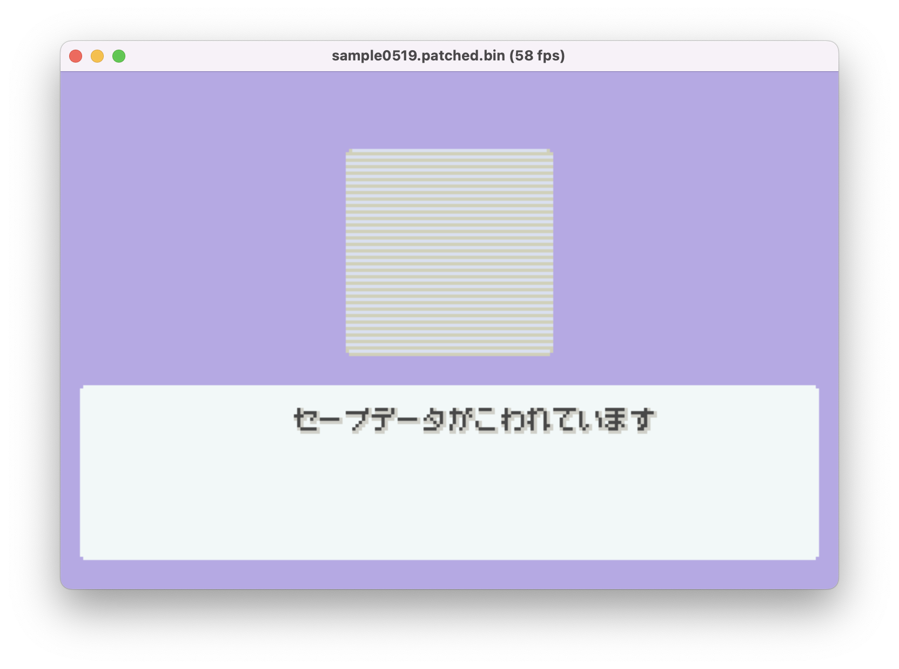
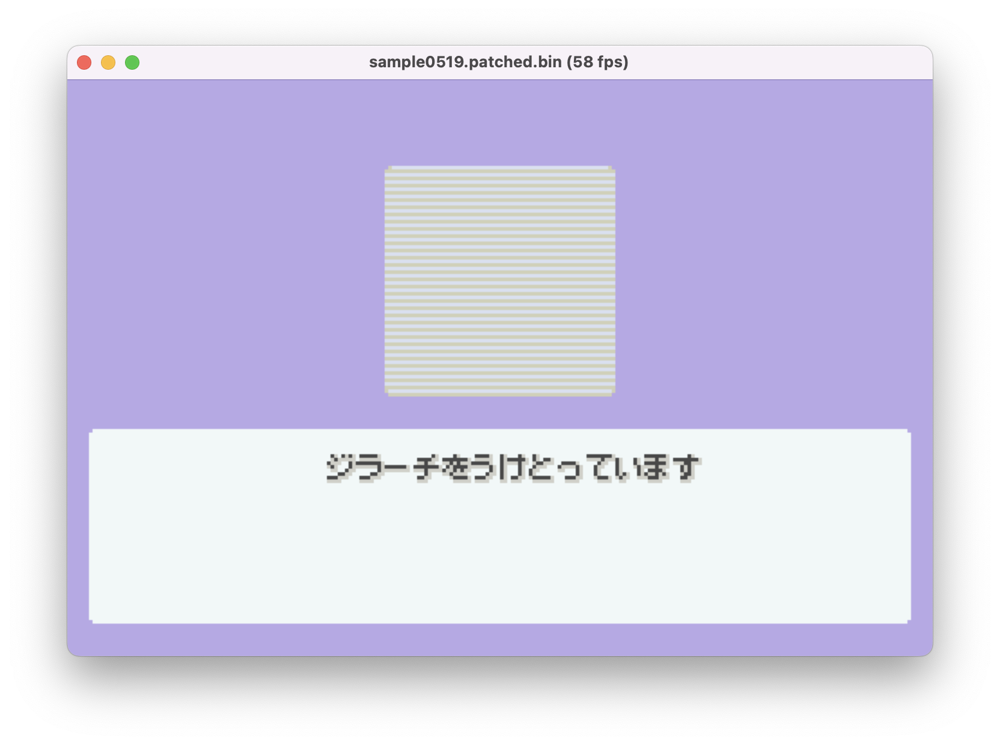

# Multiboot Jirachi Emulator Patches

These patches allow redeeming a multiboot Jirachi (Wishmaker, Meteor, and Wishing Star) on an emulator without Dolphin. This should mean it's possible for mobile and console emulators to redeem Jirachis too.

The patches remove:

- The Gamecube handshake
- The chipset check
- The game code check

## Usage

This has been tested with several emulators, but not every emulator is guaranteed to work. If you're using mgba, use the `mgba` patches, otherwise use the `other` patches.

1. Download an emulator that supports multiboot roms (most seem to)
2. Download the patch zip from the latest releases page and unzip it
3. Put your desired patch is in the same directory as the multiboot rom if your emulator supports live patching, otherwise apply the patch with a tool like [flips](https://github.com/Alcaro/Flips)
4. Rename your Pokemon Ruby or Sapphire save to the name of your multiboot rom (this allows the multiboot to access your game's save)
5. Load the multiboot rom like any other rom

## Differences between redemption

Differences:

- Wishmaker uses a save seed with TID 20043 and a broken shiny lock
- Meteor uses a save seed with TID 30719, a broken shiny lock, and the same generation as Wishmaker
- Wishing star uses an RTC seed with TID 30719, a working shiny lock, and different generation than the other two

In other words:

- Meteor has different shinies than Wishmaker
- Wishing star is the easiest, since it's an RTC seed, but no shinies
- Wishing star has different spreads

## Notable spreads

Wishing star spreads where all ivs are 25+:

```
Seed: 191d, PID: 281dcad5, IVs: 21/28/31/26/25/25, Shiny: false
Seed: 1d0b, PID: 1638285d, IVs: 31/26/28/25/28/27, Shiny: false
Seed: 246e, PID: 37016259, IVs: 23/29/30/30/25/25, Shiny: false
Seed: 357d, PID: 17e7c32b, IVs: 23/31/31/28/28/27, Shiny: false
Seed: 37f2, PID: ccd89921, IVs: 29/25/28/31/31/31, Shiny: false
Seed: 5705, PID: 90070d00, IVs: 21/31/29/31/25/31, Shiny: false
Seed: 5a11, PID: 0f2248cb, IVs: 29/26/25/26/26/29, Shiny: false
Seed: 7283, PID: 10d1e399, IVs: 21/31/28/29/26/27, Shiny: false
Seed: 7671, PID: feec4120, IVs: 31/29/25/28/29/29, Shiny: false
Seed: bf76, PID: 5c31c17d, IVs: 31/27/31/31/27/31, Shiny: false
Seed: c9e5, PID: fc153744, IVs: 31/25/29/31/25/25, Shiny: false
Seed: cfa3, PID: ce160092, IVs: 28/26/31/25/28/27, Shiny: false
Seed: daf4, PID: dcfb9816, IVs: 31/27/30/29/28/26, Shiny: false
Seed: ea8a, PID: 84b67156, IVs: 27/25/31/31/31/29, Shiny: false
Seed: ec03, PID: bde1f8e8, IVs: 30/29/31/27/31/27, Shiny: false
```

Wishing star spreads with the highest 31 iv count:

```
Seed: 8c4, PID: a09ba2a2, IVs: 31/31/31/17/30/31, Shiny: false
Seed: 5e33, PID: 16c8ffa4, IVs: 10/31/13/31/31/31, Shiny: false
Seed: bf76, PID: 5c31c17d, IVs: 31/27/31/31/27/31, Shiny: false
```

Wishing star spreads with all IVs as 27+:

```
Seed: bf76, PID: 5c31c17d, IVs: 31/27/31/31/27/31, Shiny: false
Seed: ec03, PID: bde1f8e8, IVs: 30/29/31/27/31/27, Shiny: false
```

Meteor spreads with all IVs as 27+:

```
Seed: bd9d, PID: be845336, IVs: 31/30/28/27/29/29, Shiny: false
Seed: d517, PID: e812b093, IVs: 31/29/30/31/30/31, Shiny: false
```

Wishing star with most 0 IVs:

```
Seed: 137e, PID: e555d451, IVs: 00/00/00/30/00/07, Shiny: false
Seed: 4fd7, PID: 09461a5b, IVs: 00/00/14/00/20/00, Shiny: false
```

## Building the patches

1. Dump the multiboot roms from the Wishmaker bonus disc and put them in the repo directory
2. Install [armips](https://github.com/Kingcom/armips) and [flips](https://github.com/Alcaro/Flips)
3. Run `make`

## Using the rng reference

1. Install rust
2. Run `cargo run -- --help` in the rng reference directory

## Wishing Star error screenshots

These aren't translated. I patched the game for the different error cases and took a screenshot of the message that appeared.

| Screenshot                                                                 | Error                                                                                                                                           |
| -------------------------------------------------------------------------- | ----------------------------------------------------------------------------------------------------------------------------------------------- |
|                      | No Pokedex                                                                                                                                      |
|                            | No Save                                                                                                                                         |
|                      | Party Full                                                                                                                                      |
|              | Corrupted Save                                                                                                                                  |
|  | The text translates to "Received Jirachi", but the Jirachi image is not shown. If I recall correctly, this is caused by a failed chipset check. |

## Credits

Thanks to:

- [RichardPaulAstley](https://github.com/RichardPaulAstley) for helping test!
- PokeFinder for the rtc ordinal fix when a year is greater than 2000
